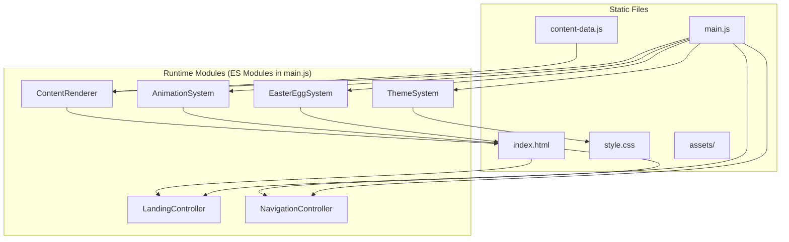
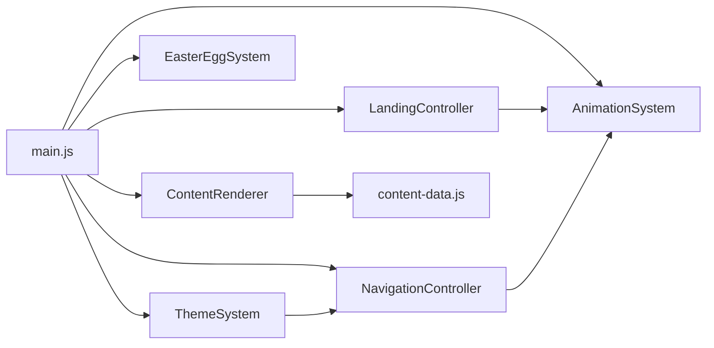

# Design Document: Portfolio Redesign

## Overview

This design transforms the existing single-page HTML/CSS portfolio into an expressive, personality-driven experience built with HTML, CSS, and vanilla JavaScript. The redesign replaces the current flat layout with a three-facet structure (About, Interests, Coder) preceded by an animated landing sequence. Each section has its own visual identity while maintaining cohesion through a shared animation system, typography scale, and color architecture.

The codebase cleanly separates content data from presentation, uses CSS custom properties for theming, and relies on Intersection Observer + CSS classes for performant scroll-driven animations. No framework or build step is required; the site remains deployable as static files.

### Key Design Decisions

| Decision | Rationale |
|----------|-----------|
| Vanilla JS only (no framework) | Keeps bundle size minimal, avoids build tooling, matches existing stack |
| CSS custom properties for theming | Enables night mode toggle and section-specific palettes without duplicating styles |
| Intersection Observer for scroll animations | Native API, no library dependency, GPU-friendly when paired with transforms/opacity |
| Content stored in JS data objects | Separates content from markup per Requirement 13, enables easy updates |
| Single HTML file with section landmarks | Keeps routing simple, uses native smooth scroll, good for SEO/accessibility |
| GSAP optional, not required | Design works with CSS animations alone; GSAP can be added for polish without architectural changes |

---

## Architecture

### High-Level Architecture



### File Structure

```
/
├── index.html              # Semantic HTML shell with section landmarks
├── style.css               # All styles: base, components, sections, themes, animations
├── main.js                 # Application entry point, module orchestration
├── content-data.js         # Structured content data (JSON-like JS objects)
├── assets/
│   ├── profile_image.jpg   # Existing profile image
│   ├── github.png          # Existing social icon
│   ├── instagram.png       # Existing social icon
│   └── icons/              # Interest card icons (SVG inline or small PNGs)
└── .kiro/specs/...         # Spec files (not deployed)
```

### Module Dependency Flow



All modules are initialized from `main.js` on `DOMContentLoaded`. Modules communicate through DOM events and shared CSS classes rather than direct coupling.

---

## Components and Interfaces

### 1. LandingController

Manages the typewriter animation sequence and transition into the main site.

```javascript
// Interface
class LandingController {
  constructor(containerEl, options) {}
  
  // Start the landing animation sequence
  start(): void
  
  // Skip animation immediately, show main content
  skip(): void
  
  // Called internally when sequence completes
  _onComplete(): void
}

// Options
{
  typingSpeed: { min: 50, max: 120 },  // ms per character
  cursorBlinkDuration: 500,             // ms before typing starts
  pauseAfterTyping: 800,               // ms pause after text completes
  transitionDuration: 1000,             // ms for fade-out transition
  text: "codegeek version 2004"
}
```

**Behavior:**
1. Show blinking cursor for `cursorBlinkDuration` ms
2. Type text character-by-character at random speed within range
3. Pause for `pauseAfterTyping` ms
4. Trigger CSS fade/slide transition to reveal main site
5. Listen for click/scroll/keydown to call `skip()`

### 2. NavigationController

Handles section navigation, active state tracking, and mobile menu.

```javascript
class NavigationController {
  constructor(navEl, sections) {}
  
  // Scroll to a section with smooth animation
  navigateTo(sectionId: string): void
  
  // Update active indicator based on scroll position
  updateActiveState(): void
  
  // Toggle mobile menu open/closed
  toggleMobileMenu(): void
  
  // Get currently visible section
  getCurrentSection(): string
}
```

**Behavior:**
- Uses `IntersectionObserver` to detect which section is in view
- Updates `aria-current` and visual indicator on nav links
- On mobile (<768px), renders as hamburger menu with slide-in panel
- Smooth scrolling uses `scrollIntoView({ behavior: 'smooth' })`

### 3. AnimationSystem

Centralized scroll-reveal and hover animation orchestration.

```javascript
class AnimationSystem {
  constructor(options) {}
  
  // Register elements for scroll-triggered reveal
  observe(elements: NodeList | Element[], animationClass: string): void
  
  // Check and respect prefers-reduced-motion
  isReducedMotion(): boolean
  
  // Remove all observers (cleanup)
  destroy(): void
}

// Options
{
  threshold: 0.15,          // visibility threshold to trigger
  rootMargin: '0px 0px -50px 0px',
  once: true                // animate only on first appearance
}
```

**Behavior:**
- Creates a single `IntersectionObserver` instance
- Adds `.is-visible` class when elements enter viewport
- CSS handles actual animations via `.is-visible` selectors
- If `prefers-reduced-motion: reduce`, skips class addition (elements start visible)
- Elements start with `.will-animate` class (opacity: 0, transform offset)

### 4. ThemeSystem

Manages color palette via CSS custom properties and optional night mode.

```javascript
class ThemeSystem {
  constructor(toggleEl) {}
  
  // Toggle between light and dark mode
  toggle(): void
  
  // Get current mode
  getMode(): 'light' | 'dark'
  
  // Apply section-specific accent palette
  applySectionPalette(sectionId: string): void
  
  // Persist preference to localStorage
  _savePreference(mode: string): void
  
  // Load saved preference
  _loadPreference(): string | null
}
```

**Behavior:**
- Toggles `data-theme="dark"` attribute on `<html>`
- CSS custom properties switch based on `[data-theme="dark"]` selector
- Persists choice in `localStorage`
- Respects `prefers-color-scheme: dark` as initial default
- Transition: 400ms on `background-color` and `color` properties

### 5. EasterEggSystem

Listens for hidden triggers and activates secret interactions.

```javascript
class EasterEggSystem {
  constructor() {}
  
  // Start listening for keyboard sequences and shortcuts
  activate(): void
  
  // Show terminal overlay with predefined responses
  showTerminal(): void
  
  // Hide terminal overlay
  hideTerminal(): void
  
  // Process terminal input
  processCommand(input: string): string
  
  // Trigger hidden message reveal
  revealSecret(secretId: string): void
}
```

**Behavior:**
- Tracks keystrokes in a buffer, matches against trigger words ("terminal", "hello")
- Keyboard shortcut: `Ctrl+Shift+T` opens terminal overlay
- Terminal overlay: fixed-position dark panel with monospace text, 3-5 predefined commands
- Does not interfere with screen readers (hidden from accessibility tree when inactive, uses `aria-hidden`)

### 6. ContentRenderer

Builds HTML from structured data objects.

```javascript
class ContentRenderer {
  constructor(contentData) {}
  
  // Render all interest cards into container
  renderInterestCards(containerEl: Element): void
  
  // Render project cards for Coder section
  renderProjectCards(containerEl: Element): void
  
  // Render skills tags
  renderSkills(containerEl: Element): void
  
  // Render experience timeline entries
  renderTimeline(containerEl: Element): void
}
```

**Behavior:**
- Reads from `content-data.js` exported objects
- Uses `document.createElement` / template literals for DOM construction
- Assigns `.will-animate` classes for AnimationSystem to pick up
- Generates semantic HTML with appropriate ARIA attributes

---

## Data Models

### Content Data Structure (content-data.js)

```javascript
// Profile/About data
const profileData = {
  name: "Janvi Singh",
  tagline: "codegeek version 2004",
  bio: "...",
  traits: [
    { label: "Structured", description: "..." },
    { label: "Spontaneous", description: "..." }
  ],
  social: {
    github: "https://github.com/JanviSingh22",
    instagram: "..."
  }
};

// Interests data
const interestsData = [
  {
    id: "painting",
    title: "Painting",
    icon: "palette",        // icon identifier or SVG path
    description: "...",
    accentColor: "#8B9E6B", // per-card accent from earth tone palette
    size: "large"           // controls card size variation: "small" | "medium" | "large"
  },
  // ... 18+ interest items
];

// Coder section data
const coderData = {
  skills: [
    { name: "Python", category: "languages", level: "advanced" },
    { name: "SQL", category: "languages", level: "intermediate" },
    { name: "JavaScript", category: "languages", level: "intermediate" },
    { name: "HTML/CSS", category: "frontend", level: "advanced" },
    // ...
  ],
  projects: [
    {
      id: "project-1",
      title: "...",
      description: "...",
      tech: ["Python", "..."],
      link: "...",
      image: null  // optional
    }
  ],
  timeline: [
    {
      year: "2024",
      title: "...",
      description: "..."
    }
  ]
};

// Easter egg commands
const easterEggCommands = {
  "hello": "Hey there! You found me. Welcome to the secret terminal.",
  "help": "Available commands: hello, about, skills, whoami, exit",
  "whoami": "A curious explorer who likes to poke around websites.",
  "about": "This portfolio was hand-crafted with vanilla JS and a lot of intention.",
  "skills": "HTML, CSS, JavaScript, Python, SQL, Design, and a love for clean code.",
  "exit": "__CLOSE__"
};
```

### CSS Custom Properties (Theme Tokens)

```css
:root {
  /* Primary palette */
  --color-bg-primary: #FFFFFF;
  --color-bg-secondary: #F9F7F4;
  --color-text-primary: #1A1A1A;
  --color-text-secondary: #4A4A4A;
  --color-text-muted: #7A7A7A;
  
  /* Section accents */
  --color-about-accent: #C8A96E;      /* soft gold */
  --color-about-bg: #FAF6F0;          /* warm beige */
  --color-interests-accent: #6B8E5E;  /* organic green */
  --color-interests-bg: #F4F7F2;      /* soft sage */
  --color-coder-bg: #1A1A2E;          /* soft black */
  --color-coder-accent: #4A5568;      /* muted navy */
  --color-coder-text: #E2E8F0;        /* light text for dark bg */
  
  /* Typography */
  --font-heading: 'Playfair Display', Georgia, serif;
  --font-body: 'Inter', -apple-system, sans-serif;
  --font-mono: 'JetBrains Mono', 'Courier New', monospace;
  
  /* Type scale (modular scale ~1.25) */
  --text-xs: 0.75rem;
  --text-sm: 0.875rem;
  --text-base: 1rem;
  --text-lg: 1.125rem;
  --text-xl: 1.25rem;
  --text-2xl: 1.5rem;
  --text-3xl: 1.875rem;
  --text-4xl: 2.25rem;
  --text-5xl: 3rem;
  
  /* Spacing scale */
  --space-1: 0.25rem;
  --space-2: 0.5rem;
  --space-3: 0.75rem;
  --space-4: 1rem;
  --space-6: 1.5rem;
  --space-8: 2rem;
  --space-12: 3rem;
  --space-16: 4rem;
  --space-24: 6rem;
  
  /* Animation */
  --ease-out: cubic-bezier(0.16, 1, 0.3, 1);
  --ease-in-out: cubic-bezier(0.65, 0, 0.35, 1);
  --duration-fast: 200ms;
  --duration-normal: 400ms;
  --duration-slow: 800ms;
  --duration-landing: 1000ms;
  
  /* Layout */
  --max-width: 1200px;
  --nav-height: 60px;
}

/* Night mode overrides */
[data-theme="dark"] {
  --color-bg-primary: #121212;
  --color-bg-secondary: #1E1E1E;
  --color-text-primary: #F0F0F0;
  --color-text-secondary: #B0B0B0;
  --color-text-muted: #808080;
  --color-about-bg: #1A1A14;
  --color-interests-bg: #141A14;
}
```

### HTML Structure (Semantic Landmarks)

```html
<!DOCTYPE html>
<html lang="en" data-theme="light">
<head>...</head>
<body>
  <!-- Skip link for accessibility -->
  <a href="#main-content" class="skip-link">Skip to content</a>
  
  <!-- Landing overlay -->
  <section id="landing" class="landing" aria-label="Introduction animation">
    <div class="landing__cursor" aria-hidden="true"></div>
    <div class="landing__text" aria-live="polite"></div>
  </section>
  
  <!-- Main site (hidden until landing completes) -->
  <div id="main-content" class="main-wrapper" aria-hidden="true">
    
    <!-- Navigation -->
    <header class="nav" role="banner">
      <a href="#" class="nav__logo">JS</a>
      <nav class="nav__links" role="navigation" aria-label="Main navigation">
        <a href="#about" class="nav__link" aria-current="false">About</a>
        <a href="#interests" class="nav__link" aria-current="false">Interests</a>
        <a href="#coder" class="nav__link" aria-current="false">Coder</a>
      </nav>
      <button class="nav__theme-toggle" aria-label="Toggle night mode">🌙</button>
      <button class="nav__mobile-toggle" aria-label="Open menu" aria-expanded="false">☰</button>
    </header>
    
    <!-- About Section -->
    <section id="about" class="section section--about" aria-label="About me">
      <div class="section__container">
        <!-- Rendered by ContentRenderer or static HTML -->
      </div>
    </section>
    
    <!-- Interests Section -->
    <section id="interests" class="section section--interests" aria-label="My interests">
      <div class="section__container">
        <div class="interests-grid" role="list">
          <!-- Cards rendered by ContentRenderer -->
        </div>
      </div>
    </section>
    
    <!-- Coder Section -->
    <section id="coder" class="section section--coder" aria-label="Developer profile">
      <div class="section__container">
        <!-- Skills, projects, timeline rendered by ContentRenderer -->
      </div>
    </section>
    
    <!-- Footer -->
    <footer class="footer" role="contentinfo">
      <div class="social-links">...</div>
    </footer>
  </div>
  
  <!-- Easter egg terminal overlay -->
  <div id="terminal-overlay" class="terminal" aria-hidden="true" role="dialog" aria-label="Secret terminal">
    <div class="terminal__header">terminal</div>
    <div class="terminal__output"></div>
    <input class="terminal__input" type="text" aria-label="Terminal input">
  </div>
  
  <script src="content-data.js"></script>
  <script src="main.js" defer></script>
</body>
</html>
```

---


## Correctness Properties

*A property is a characteristic or behavior that should hold true across all valid executions of a system — essentially, a formal statement about what the system should do. Properties serve as the bridge between human-readable specifications and machine-verifiable correctness guarantees.*

### Property 1: Typewriter timing stays within bounds

*For any* character typed by the Typewriter_Engine, the delay before that character appears shall be between 50ms and 120ms (inclusive), and the resulting displayed string after typing N characters shall equal the first N characters of the source text.

**Validates: Requirements 1.2**

### Property 2: Active navigation indicator tracks scroll position

*For any* scroll position that places a section's top boundary within the viewport (accounting for nav height offset), the NavigationController's active indicator shall correspond to that section's nav link.

**Validates: Requirements 2.5**

### Property 3: About section renders all required profile fields

*For any* valid profileData object containing `bio` and `traits` fields, the ContentRenderer's About section output shall contain text nodes matching each of those field values.

**Validates: Requirements 3.3**

### Property 4: Interest card rendering fidelity and visual variety

*For any* valid interestsData array of length N (where each item has id, title, and accentColor), `renderInterestCards` shall produce exactly N card elements, each containing its item's title text, and cards with different accentColor values shall have distinct accent styling applied.

**Validates: Requirements 4.2, 4.6**

### Property 5: Coder section skills and timeline rendering

*For any* valid coderData object with a skills array of length S and a timeline array of length T, `renderSkills` shall produce exactly S skill elements each containing the skill name, and `renderTimeline` shall produce exactly T timeline entries in the same order as the input array.

**Validates: Requirements 5.4, 5.5**

### Property 6: Easter egg command processing returns correct responses

*For any* key present in the easterEggCommands map, calling `processCommand(key)` shall return the corresponding value from that map. For any string NOT present as a key, `processCommand` shall return a default "unrecognized command" response.

**Validates: Requirements 6.2**

### Property 7: Theme toggle is a round-trip (involution)

*For any* initial theme state (light or dark), calling `toggle()` twice shall return the Theme_System to the original state, and a single `toggle()` shall flip `data-theme` on the document element to the opposite value.

**Validates: Requirements 7.2, 7.4**

### Property 8: WCAG AA contrast for all theme color pairs

*For any* text-color and background-color pair defined in the theme (both light and dark modes), the computed contrast ratio shall be ≥ 4.5:1 for body-sized text and ≥ 3:1 for large text (≥ 18px or ≥ 14px bold).

**Validates: Requirements 7.3, 9.5**

### Property 9: Scroll-triggered visibility class application

*For any* DOM element registered with the AnimationSystem via `observe()`, when that element's intersection ratio exceeds the configured threshold, the `.is-visible` class shall be added to it. Before intersection, the element shall have only the `.will-animate` class (not `.is-visible`).

**Validates: Requirements 3.5, 8.1**

### Property 10: Reduced motion preference disables animations

*For any* element registered with the AnimationSystem, when `prefers-reduced-motion: reduce` is active, that element shall be immediately visible (no `.will-animate` opacity/transform hiding) and no transition-driven class changes shall occur on intersection.

**Validates: Requirements 8.5**

### Property 11: Animations use only GPU-friendly properties

*For any* `@keyframes` rule or CSS transition defined in the stylesheet, the animated properties shall be limited to `transform` and `opacity` (excluding theme color transitions which animate `background-color` and `color` for the 400ms mode switch).

**Validates: Requirements 8.6**

### Property 12: Interactive elements are keyboard accessible with accessible names

*For any* interactive element (buttons, links, inputs) rendered in the Portfolio_App, the element shall be reachable via sequential keyboard navigation (tabindex ≥ 0 or natively focusable) and shall have a non-empty computed accessible name (via aria-label, aria-labelledby, or text content).

**Validates: Requirements 12.1, 12.2**

### Property 13: All images have text alternatives

*For any* `` element rendered in the Portfolio_App, it shall have either a non-empty `alt` attribute describing its content, or `role="presentation"` with an empty `alt=""` if purely decorative.

**Validates: Requirements 12.5**

### Property 14: Content rendering data fidelity and structural consistency

*For any* valid content data array (interestsData, coderData.projects, coderData.timeline), the ContentRenderer shall produce DOM elements whose text content matches the corresponding data field values, and all sibling elements produced from the same array shall share identical DOM structure (same tag hierarchy and class names), differing only in text/attribute content.

**Validates: Requirements 13.1, 13.3**

---

## Error Handling

### Asset Loading Failures

| Scenario | Handling Strategy |
|----------|-------------------|
| Profile image fails to load | Display CSS-generated placeholder with initials |
| Interest card icon fails | Hide icon container, card remains functional with text only |
| Font files fail to load | CSS font stack falls back to system fonts (Georgia for serif, system sans-serif for body) |
| content-data.js fails to load | Display static HTML fallback content embedded in index.html |

### JavaScript Errors

| Scenario | Handling Strategy |
|----------|-------------------|
| AnimationSystem fails to initialize | Elements render without `.will-animate` class — content is visible by default |
| IntersectionObserver not supported | Skip scroll animations; all content visible immediately |
| ThemeSystem localStorage unavailable | Default to light theme, toggle still works in-session without persistence |
| EasterEggSystem keydown listener fails | Easter eggs simply don't activate; no impact on primary navigation |
| LandingController throws during animation | `skip()` is called as fallback, main content appears immediately |

### Graceful Degradation Strategy

```javascript
// Pattern: wrap module initialization in try/catch
try {
  const animSystem = new AnimationSystem(options);
  animSystem.observe(document.querySelectorAll('.will-animate'), 'is-visible');
} catch (e) {
  // Remove .will-animate so content is visible without animation
  document.querySelectorAll('.will-animate').forEach(el => {
    el.classList.remove('will-animate');
  });
  console.warn('AnimationSystem failed to initialize:', e);
}
```

### CSS Fallbacks

- All animated elements are visible by default; `.will-animate` class sets initial hidden state
- If JS fails to load, CSS ensures content is readable (no `display: none` in base styles for content)
- Grid layouts use `@supports` queries with flexbox fallback for older browsers

---

## Testing Strategy

### Unit Tests (Example-Based)

Unit tests verify specific behaviors with concrete inputs:

- **LandingController**: cursor appears on init, skip() reveals main content, transition fires after typing completes
- **NavigationController**: exactly 3 nav links rendered, mobile menu toggles visibility, navigateTo scrolls smoothly
- **ThemeSystem**: toggle button exists in nav, initial theme respects `prefers-color-scheme`, localStorage read/write works
- **EasterEggSystem**: Ctrl+Shift+T opens terminal, terminal overlay has aria-hidden when inactive, exit command closes overlay
- **Responsive**: mobile menu visible at <768px, desktop nav visible at ≥768px
- **Performance**: script tags have `defer`, non-viewport images have `loading="lazy"`, skip-link targets #main-content

### Property-Based Tests

Property-based tests verify universal properties across randomized inputs. Each test runs a minimum of 100 iterations.

| Property | Test Approach | Library |
|----------|---------------|---------|
| P1: Typewriter timing bounds | Generate random delay arrays, verify each ∈ [50, 120] and char accumulation is correct | fast-check |
| P2: Active nav tracks scroll | Generate random scroll offsets, verify active section matches | fast-check |
| P3: About renders profile fields | Generate random profileData objects, verify all fields in output | fast-check |
| P4: Interest card fidelity | Generate random interestsData arrays, verify count and style variety | fast-check |
| P5: Coder renderer fidelity | Generate random skills/timeline arrays, verify count and order | fast-check |
| P6: Command processing | Generate keys from command map + random strings, verify responses | fast-check |
| P7: Theme toggle round-trip | Generate random toggle sequences, verify state after even/odd toggles | fast-check |
| P8: WCAG contrast | Generate all defined color pairs, compute contrast ratio, verify ≥ threshold | fast-check |
| P9: Visibility class on intersection | Generate random elements + intersection states, verify class application | fast-check |
| P10: Reduced motion | Generate element sets, mock matchMedia, verify no animation classes | fast-check |
| P11: GPU-friendly properties | Parse CSS rules, verify animated properties ∈ {transform, opacity} | fast-check |
| P12: Keyboard accessibility | Generate interactive elements, verify focusable + accessible name | fast-check |
| P13: Image alt text | Generate img elements, verify alt or role="presentation" | fast-check |
| P14: Content rendering fidelity | Generate random data arrays, verify DOM text matches and structure is consistent | fast-check |

**PBT Library:** [fast-check](https://github.com/dubzzz/fast-check) — the standard property-based testing library for JavaScript.

**Test Configuration:**
- Minimum 100 iterations per property test (`{ numRuns: 100 }`)
- Each test tagged with: `// Feature: portfolio-redesign, Property {N}: {title}`
- Tests run via: `npx vitest --run` (vitest for fast ES module support)

### Integration Tests

- Full page load in headless browser (Playwright): verify landing → main content flow
- Navigation scroll behavior end-to-end
- Night mode toggle with visual regression snapshot
- Responsive breakpoint screenshots at 320px, 768px, 1024px, 1440px
- Lighthouse CI for performance score ≥ 80

### Accessibility Testing

- axe-core automated scan for WCAG AA compliance
- Manual keyboard navigation walkthrough
- Screen reader testing (VoiceOver/NVDA) for landmark navigation and ARIA labels
- Reduced motion simulation to verify fallback behavior

---

## Requirements Traceability Matrix

| Requirement | Design Components | Properties |
|-------------|-------------------|------------|
| R1: Landing Typewriter | LandingController, AnimationSystem | P1 |
| R2: Three-Section Navigation | NavigationController, HTML landmarks | P2 |
| R3: About Section | ContentRenderer, AnimationSystem, CSS grid | P3, P9 |
| R4: Interests Section | ContentRenderer, AnimationSystem, CSS masonry | P4, P9, P14 |
| R5: Coder Section | ContentRenderer, AnimationSystem, CSS dark theme | P5, P14 |
| R6: Easter Eggs | EasterEggSystem, terminal overlay | P6 |
| R7: Night Mode | ThemeSystem, CSS custom properties | P7, P8 |
| R8: Animation System | AnimationSystem, CSS transforms/opacity | P9, P10, P11 |
| R9: Color Palette & Typography | ThemeSystem, CSS custom properties | P8 |
| R10: Responsive Design | CSS media queries, NavigationController | — (integration tests) |
| R11: Performance | Lazy loading, deferred scripts | — (Lighthouse CI) |
| R12: Accessibility | Semantic HTML, ARIA, skip-link | P12, P13 |
| R13: Content Architecture | ContentRenderer, content-data.js | P14 |
